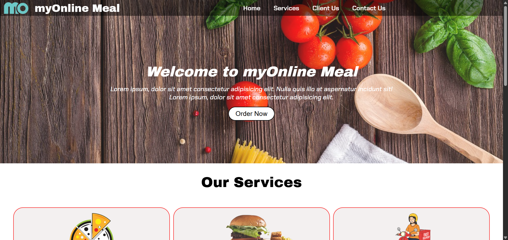
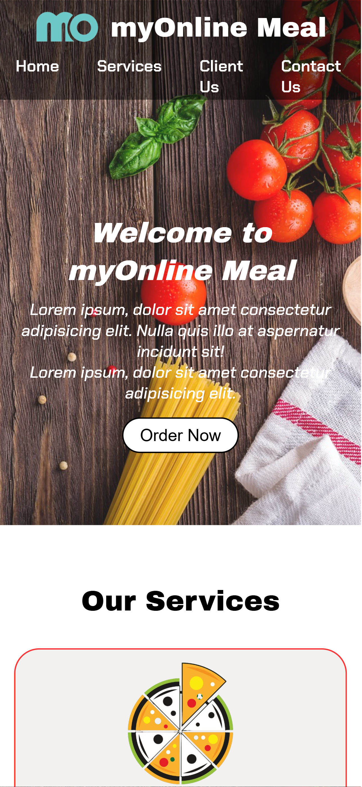

# Responsive Restaurant Website

A responsive restaurant landing page built using **HTML5** and **CSS3**.  
This project was created to strengthen my frontend fundamentals, focusing on layout design, responsiveness, and clean UI structure.

---

## 🚀 Features
- Responsive design for desktop and mobile devices
- Clean navigation bar
- Hero section with background image
- Services section layout
- Client showcase section
- Contact form UI
- Footer section

---

## 🛠️ Technologies Used
- HTML5
- CSS3
- Media Queries (for responsiveness)

---

## 📂 Project Structure

├── index.html
├── README.md
├── CSS
│ ├── style.css
│ └── phone.css
└── image

---

## 🎯 Learning Outcomes
- Improved understanding of HTML semantic structure
- Practical use of CSS Flexbox
- Responsive design using media queries
- Project structuring for real-world frontend applications

---

## 📸 Screenshots

### Desktop View

### Mobile View

---

## 📌 Author
**Sameer Kumar**  
BCA Student | Frontend Developer | Full-Stack Learner  

🔗 LinkedIn: https://www.linkedin.com/in/sameer-kumar-it  
🔗 GitHub: https://github.com/sameerkumar-dev
